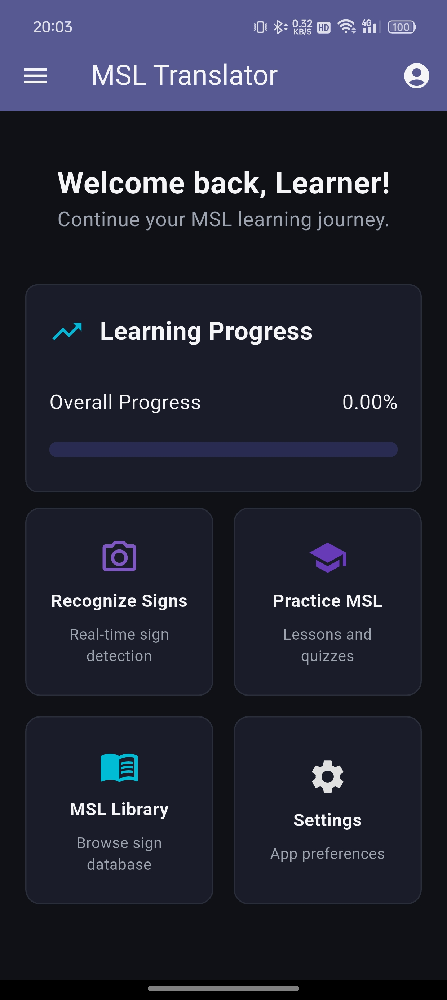

# Sign Language Recognition App

A polished Flutter learning app that helps users recognize, practice, and study sign language with camera-based inference, guided lessons, quizzes, progress tracking, and text-to-speech support.

---

## ✨ Badges

[](https://flutter.dev)
[](https://dart.dev)
[](LICENSE)
[](#)

---

## 📱 Screenshots / Demo

Add your screenshots here when you are ready:




You can also replace these with GIFs or a short screen recording preview.

---

## 🚀 Features

- Camera-based sign recognition powered by TensorFlow Lite and hand landmark detection.
- Guided practice flow for learning and repeating signs.
- Structured lessons and quizzes to support progressive learning.
- Sign library and detailed sign pages for quick reference.
- Learning progress, profile stats, achievements, and study tracking.
- Text-to-speech support with configurable voice, speed, autoplay, and haptics.
- Dark mode and local settings persistence using shared preferences.
- Offline-friendly local storage with SQLite-backed data management.

---

## 🧰 Tech Stack

- Flutter
- Dart
- go_router for navigation
- camera for live camera capture
- hand_landmarker for hand landmark detection
- tflite_flutter for on-device inference
- flutter_tts for speech feedback
- shared_preferences for app settings
- sqflite and sqflite_common_ffi for local storage
- connectivity_plus for network awareness
- image_picker and image_cropper for image workflows
- path_provider and path for file handling
- youtube_player_flutter for embedded video content
- dropdown_button2 and show_fps for UI and diagnostics

---

## 🛠️ Getting Started

### Prerequisites

- Flutter SDK 3.9.x or newer
- Dart 3.9.2 or newer
- Android Studio, VS Code, or another Flutter-compatible editor
- A connected device or emulator/simulator for Android, iOS, or desktop

### Installation

1. Open the project releases page and download the `v1.0.0` APK from the release assets.
2. Install the APK on an Android device running Android 10 or above.
3. Open the app after installation and allow any requested permissions.

If you want to run the source code instead of using the release APK, make sure your Flutter setup supports the target platform before running the app.

```bash
git clone <your-repository-url>
cd sign_language_recognition_app
flutter pub get
flutter run
```

---

## 🗂️ Project Structure

```text
sign_language_recognition_app/
├── lib/
│   ├── main.dart
│   ├── models/
│   ├── pages/
│   ├── painter/
│   ├── router/
│   ├── services/
│   ├── shared/
│   ├── tflite_model/
│   └── utils/
├── assets/
│   ├── db/
│   ├── icon/
│   ├── images/
│   └── model/
├── test/
├── android/
├── ios/
├── web/
├── windows/
├── linux/
└── macos/
```

---

## ⚙️ Configuration

- App settings are persisted locally with `shared_preferences`.
- Dark mode is wired through `SettingsService.darkModeNotifier` for instant UI updates.
- Model and database assets are bundled in `assets/model/` and `assets/db/`.
- No environment file or flavor setup is currently defined in the project.
- If you add CI/CD later, replace the build badge with your workflow badge URL.

---

## 🧪 Running Tests

Run the full test suite with:

```bash
flutter test
```

To run a specific test file:

```bash
flutter test test/achievement_service_test.dart
```

---

## 🤝 Contributing

1. Fork the repository and create a feature branch.
2. Make focused, well-scoped changes.
3. Run `flutter test` before opening a pull request.
4. Keep the code style consistent with the existing project structure.
5. Include screenshots or notes when UI behavior changes.

---

## 📄 License

This project is licensed under the MIT License.
